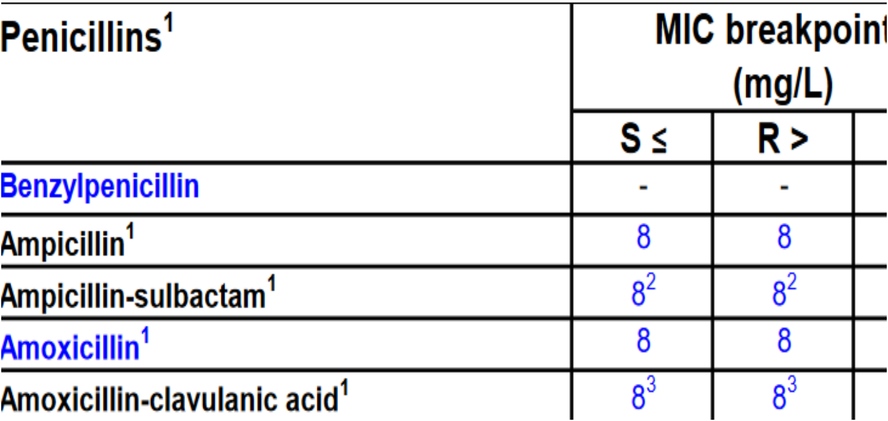

class:top,left

background-image: url("img/dtu_red.png")

background-size: contain


---
class: top, left

background-image: url("img/impdtu.png")

background-size: contain


---
class: middle, left

<!-- edit name1 and name2 in the YAML above -->

```{r setup, echo=FALSE, warning=FALSE, message=FALSE}
options(htmltools.dir.version = FALSE)
knitr::opts_chunk$set(warning = FALSE, message = FALSE)
library(tidyverse) # load tidyverse package
library(babynames) # load babynames package
#library(leaflet) # uncomment to use if you install
#devtools::install_github("jacob-long/jtools")
library(jtools)
#install.packages("missCompare")
library(missCompare)
#vignette("misscompare")
library(data.table)
library(here)
```

```{r xaringan-themer, include=FALSE, warning=FALSE}
library(xaringanthemer)
style_duo_accent(
  primary_color = "#1381B0",
  secondary_color = "#FF961C",
  inverse_header_color = "#FFFFFF"
)
```


## Learning objectives 🎒

--


- Describe technique for imputation of missing data


--


- Carry out data imputation


## Contents 👣


- __PART I__


--


- Missing data at random & not at random


--


- Things to consider before doing imputation and Deduce missing values


--


- __PART II___


- __Imputation approaches__


--


- single imputation
    

--


- multiple imputation


???


a) Deductive imputation
    


    
    
- Imputation using algorithm(s) 

 - obtain the missing data

 - single and multiple


---
class:middle, inverse

### Missing data


--


> Incomplete information is a very common problem.


```{r echo=FALSE, out.width="60%"}
library(DiagrammeR)
DiagrammeR::grViz("digraph{
                  graph [layout = dot, rankdir = LR]
                  node [shape = rectangle]
                  rec1 [label = 'missing data']
                  rec2 [label = 'deletion']
                  rec3 [label = 'impute']
                  rec1 -> rec2
                  rec1 -> rec3
                  }
                  ",height = 200)
```


--

.pull-left[

__At random__  🎲

- missingness is nothing to do with the subject being studied

- unreadable sample labels, damaged sample during the transportation


]


--


.pull-right[

__not at random__

- the missing values of a variable are related to the variable itself


-  missing answers in the questionnaire for fear to be penalized


]


???

| Type          	| What is it?                                                	| Example                                                                	|
|---------------	|-----------------------------------------------------------	|------------------------------------------------------------------------	|
| At random     	| missingness is nothing to do with the subject being studied         	| unreadable sample labels, damaged sample during the transportation 	|
| Not at random 	| the missing values of a variable are related to the variable itself 	| missing answers in the questionnaire for fear to be penalized       	|


---
class: center

## Deletion shortcommings*


.pull-left[


```{r, message=FALSE, warning=FALSE, echo=FALSE, fig.align='center', out.width='90%'}
library(DiagrammeR)
DiagrammeR::grViz("digraph {
  graph [layout = dot, rankdir = TB]
  
  node [shape = rectangle]        
  rec1 [label = 'Data set']
  rec2 [label = 'Missing data \n completly at random']
  rec3 [label = 'Missing data \n not at random']
  rec7 [label = 'casedeletion']
  rec8 [label = 'casedeletion']
  rec4 [label = 'Likelihood \n of bias = no']
  rec5 [label = 'Likelihood \n of bias = yes']
  rec6 [label = 'Less power']
  
  # edge definitions with the node IDs
  rec1 ->  rec2 
  rec1 ->  rec3
  rec2 ->  rec7
  rec3 ->  rec8
  rec7 ->  rec4
  rec8 ->  rec5
  rec4 ->  rec6
  }", 
  height = 500)
```

]


.pull-right[

__case deletion__

👍 the discarded cases are like a random subsample. 

👎 the discarded cases are not missing at random, let alone less power, estimates may be seriously biased.

💭 in multivariate problems, large portion data discarded causes an unacceptable loss of power


]


.footnote[[*] Schafer JL. Multiple imputation: a primer. Statistical Methods in Medical Research. 1999;8(1):3-15]


???


- subjects having any predictor or dependable missing data is excluded from an analysis. 


- if the missing data is not at random.  the consequence is that regression coefficient estimates that can be very biased,


-


- casewise deletion of incomplete records is inefficient too. 


- the power of the analysis decreases


- it increases standard errors,widens confidence intervals and decreases the fit of the model


---
class: middle, inverse

--

## __STEPs__ before doing imputation

--

#### Describe and clean data 📈

--


#### Deduce missing data 	🤔


--


#### Try getting missing data; i. e. calling ☎, or other means📧


---
class:top
### Describe and clean your data 🔍 	

--

- __CASE 1__ Consider set as missing (NA) impossible data

--


.pull-left[

```{r echo=FALSE}
options(digits = 2)
dfa <- read_csv(here("data", "dfa.csv"))
data.table(dfa)
```


```{r}
range(dfa$age)
```

]


--


.pull-right[
```{r echo=FALSE, out.width ="80%"}
options(digits = 1)
students <- sample(c("female","male"), 500, replace=TRUE, prob = c(0.53, 0.47))
age <- runif(500, 18,35)
df <- data.frame(students, age)

#write_csv(dfa, here("data", "dfa.csv"))
dfa <- read_csv(here("data", "dfa.csv"))
#dfa <- edit(df)
gdf <- ggplot(dfa, aes(x = students, y = age, color = students)) +
  geom_boxplot(outlier.colour="black", outlier.shape=8,
                outlier.size=4, notch = TRUE) + labs(y = "age-years", x = "college students") + theme(legend.position = "none") +   theme_xaringan() 
gdf

```


]


--


See __outliers__ they are impossible values; consider set as NA


???


class:top, center


What do you do with these values? 


---
class:top
### Describe and clean your data 🔍 	

--


__CASE 2__ many missing values


--


- consider deletion of variables and observations 🤔


```{r, echo=FALSE}
eu2 <- read_csv(here("data", "eu2.csv"))
#library(DT)
#eu3 <- eu2 %>%
 # mutate(id = c(1:30))%>%
  #select(id, "2010", "2011", "2012", "2013", "2014","2015") %>%
  #datatable(elementId = FALSE)
#eu3
#data.table(eu2)
```

- __variable__ with many missing observations (16/30)


```{r message=FALSE, echo=FALSE}
options(width = 60)

eu2$`2010`
```


--

- __observation__ with missing data points (3/10) 


```{r message=FALSE, echo=FALSE}
#library(data.table)
#eu3 <- data.table(eu3)
slo <- eu2%>% mutate(id = c(1:30))
slo <- eu2[c(8),-c(1)]
as.data.frame(slo)
```


--


- __delete__ variables with > 50% missingness*

- __delete__ observations with >80% missigness*


.footnote[[*] Thresholds up to you. Based on Tibor V. Varga and David Westergaard (2020). missCompare: Intuitive Missing Data Imputation Framework. ]


---
class: middle, left, inverse

## Deduce __missing__ data 🤔


--

#### sometimes you get the missing data by deductive imputation*:

--

- constant variables: e.g. gender

--

- prospective changes: e.g. age

--

- cumulative variables: e.g. parity, pregnancies

--

- dependent variables: e.g. Body mass index


.footnote[[*] Tibor V. Varga and David Westergaard (2020). missCompare: Intuitive Missing Data Imputation Framework.]

---
class: top, left

> __Constant__ species, gender, name, breed. 
> __prospective data__ i.e time


--


.pull-left[

#### before

| ID  	| Date       	| Specie  	| MRSA     	|
|-----	|------------	|---------	|----------	|
| ID1 	| 01-01-2010 	| cattle  	| negative 	|
| ID1 	| 01-01-2011 	| __NA__   	| positive 	|
| ID1 	| 01-01-2012 	| cattle  	| positive 	|

]


--


.pull-right[
#### after

| ID  	| Date       	| Specie  	| MRSA     	|
|-----	|------------	|---------	|----------	|
| ID1 	| 01-01-2010 	| cattle  	| negative 	|
| ID1 	| 01-01-2011 	| __cattle__| positive 	|
| ID1 	| 01-01-2012 	| cattle  	| positive 	|

]


--


.pull-left[

#### before


| ID  	| Date       	| Age     	| MRSA     	|
|-----	|------------	|---------	|----------	|
| ID1 	| 01-01-2010 	| 1       	| negative 	|
| ID1 	| NA        	| 2       	| positive 	|
| ID1 	| 01-01-2012 	| 3         | positive 	|

]


--


.pull-right[

#### after


| ID  	| Date       	| Age     	| MRSA     	|
|-----	|------------	|---------	|----------	|
| ID1 	| 01-01-2010 	| 1       	| negative 	|
| ID1 	| __01-01-2011__ 	| 2        	| positive 	|
| ID1 	| 01-01-2012 	| 3         | positive 	|

]


???
## Imputation strategies

> Imputation of missing data is better than discarding incomplete observations.


---
class:top, left


> __Cumulative Variables__ parity class & __Dependant variables__ DDD


--


.pull-left[

#### before

| ID  	| Year 	| parity class	| MRSA     	|
|-----	|------	|-------------  |----------	|
| ID1 	| 2010 	| 1             | negative 	|
| ID1 	| 2011 	| __NA__        | positive 	|
| ID1 	| 2012 	| 3  	          | positive 	|

]

--

.pull-right[

#### after

| ID  	| Years	| parity class	| MRSA     	|
|-----	|------	|-------------- |----------	|
| ID1 	| 2010 	| 1             | negative 	|
| ID1 	| 2011 	| __2__         | positive 	|
| ID1 	| 2012 	| 3  	          | positive 	|

]

---

 

> __Dependant variables__ DDD/person-year $=\frac{DDD}{population}$ 

###  some simple maths (➗  ,   ✖  ,    ➖   ,    ➕)


--

#### before

| Region  	| Population 	| DDD         	| DDD/person-year     	    |
|--------   |------------	|-------------- |-------------------------	|
| a    	    | 4e+06     	| 20e+06        | 5       	                |
| b 	      | 10e+05    	| 50e+05        | __NA__   	                |
| c 	      |  10e+06	    | 30e+06        | 3       	                |


--


#### after

| Region  	| Population 	| DDD         	| DDD/person-year   |
|--------   |------------	|-------------- |------------------	|
| a    	    | 4e+06 	    | 20e+06        | 5                 |
| b 	      | 1e+05    	  | 5e+05         | __5__             |
| c 	      |  10e+06	    | 30e+06        | 3   	            |


---
class:top, left, inverse

### Quiz: Deduce the missing value


--


.pull-left[

| Isolate 	| MIC 	| AST 	|
|---------	|-----	|-----	|
| 1       	| 12  	| R   	|
| 2       	| 4   	| S   	|
| 3       	| 8   	| __?__	|


]


--


.pull-right[




]


--

### Answer


--


| Isolate 	| MIC 	| AST 	|
|---------	|-----	|-----	|
| 1       	| 12  	| R   	|
| 2       	| 4   	| S   	|
| 3       	| 8   	| R    	|


???


class: bottom, left


##### Penicillins consumption in the EU, DDD per 1,000 inhabitants per day

```{r, echo=FALSE}
#eu <- read_csv(here("data", "antibiotica.csv"))
#write_csv(eu2, here("data", "eu2.csv"))
#eu2 <- edit(eu)
```

---

# PART II


--


## Imputation techniques


--


__Imputation__, the practice of 'filling in' missing data with plausible values*


--


Single imputation


--

__e.g.__ mean, median


--


Multiple imputation


--

__e.g.__ probability methods


--


.footnote[[*] Schafer JL. Multiple imputation: a primer. Statistical Methods in Medical Research. 1999;8(1):3-15]


---
class:top

### Imputation guidelines*


#### Proportion of missings __<= 0.05:__ 


- " __single imputation__...missing data is filled in without an 
explicit model ..."(C.A.W. Glas, 2010)


--

- __continuous variables__ imputing missings with the median or mean 
  
--
    
- __categorical predictors__ the most frequent category can be used 

--

#### Proportion of missings >__0.05 


- __Multiple imputation__ which "... aims to allow for the uncertainty about the missing data by creating several different plausible imputed data sets and appropriately combining results obtained from each of them." (BMJ 2009;338:b2393)


--


    
.footnote[[*] Regression Model Strategies, F. Harrel Jr]


???


---

### Single imputation example: numeric and categorical


--

```{r message=FALSE, warning=FALSE, echo=FALSE}
library(Hmisc)
```

```{r echo=FALSE, eval=FALSE}
ei <- emc %>%
  as_tibble() %>%
  mutate(across(c(1:9), impute))
ei[c(1:10),c(1:6)]
```


```{r echo=FALSE, eval=FALSE}
datatable(ei, options = list(
  columnDefs = list(list(className = 'dt-center', targets = 5)),
  pageLength = 5,
  lengthMenu = c(5, 10, 15, 20)
))
```


.pull-left[

Before missing numeric


```{r echo=FALSE, highlight.output= c(2:4)}
x<- matrix(1:10, ncol=2)
x[c(1,3,7)] <- NA
print(x)

```


]


--


.pull-right[


after


```{r echo=FALSE, highlight.output= c(2:4)}
x <- impute(x)

x
```


]


--


.pull-left[


before missing character


```{r, echo=FALSE}
set.seed(123)
x1 <- factor(sample(c('a','b','c'),100,TRUE))
x2 <- (x1=='b') + 3*(x1=='c') + rnorm(100,0,.4)
x3 <- rnorm(100)
y  <- x2 + 1*(x1=='c') + .2*x3 + rnorm(100,0,.4)
orig.x1 <- x1[1:20]
orig.x2 <- x2[18:23]
x1[1:3] <- NA
#x2[18:23] <- NA
#x2[21:25] <- NA
d <- data.frame(x1,x2,x3,y, stringsAsFactors=TRUE)

knitr::kable(head(d,4))

```

]


--


.pull-right[

after (most common character is used)

```{r, echo=FALSE, warning=FALSE}
options(digits = 2)
e <- e1071::impute(d)
knitr::kable(head(e,4))
```
]


```{r eval=FALSE, echo=FALSE}

euc <- missCompare::clean(eu,
                          var_removal_threshold = 0.5, 
                          ind_removal_threshold = 0.7)
```


```{r eval=FALSE, echo=FALSE}
eudat <- missCompare::get_data(euc,
                                  matrixplot_sort = T,
                                  plot_transform = T)
names(eudat)
```


???


```{r eval=FALSE, echo=FALSE}
eudat$Fraction_missingness
eudat$Total_NA
```


```{r out.width='50%', eval=FALSE, echo=FALSE}
eudat$Matrix_plot
```


---
class:top, left

## Multiple imputation: example*


```{r echo=FALSE}
eu <- read_csv(here("data", "antibiotica.csv"))
#eu$Country <- as.factor(eu$Country)
eus <- eu
eu <- eu[,-c(1)]

#eu2 <- eu2[,-c(1)]
```

```{r, echo=FALSE, eval=FALSE}
library(DT)
options(width = 75)
datatable(eu2, width = 60)
```


```{r echo=FALSE}
set.seed(123)
createNAs <- function (x, pctNA = 0.1) {
  n <- nrow(x)
  p <- ncol(x)
  NAloc <- rep(FALSE, n * p)
  NAloc[sample.int(n * p, floor(n * p * pctNA))] <- TRUE
  x[matrix(NAloc, nrow = n, ncol = p)] <- NA
  return(x)
}

eum <- createNAs(eu)
```


--

```{r echo=FALSE, eval=FALSE, options = list(scrollX = TRUE)}
library(DT)
#datatable(eum, options = list(dom = 't')) 

  
datatable(eu2, options = list(
  columnDefs = list(list(className = 'dt-center', targets = 5)),
  pageLength = 5,
  lengthMenu = c(8, 16, 24, 30)
))
```


```{r, echo=FALSE}
eushow <- eu2[c(1,6:10),c(1:8)]
knitr::kable(eushow)
```


--

- Let us see a summary of the data and clean it 

--

.footnote[[*]Trends in consumption of tetracyclines (ATC group J01A) in the community, EU/EEA countries, 20010–2019, expressed as DDD per 1 000 inhabitants per day. The __data__ used here  has been modified inserting NA at random for teaching purposes]


???

Maybe cleaning (remove variable with a lot of missing data)


- Let us see some plots of these data 

---
### Data* summary

```{r, echo=FALSE, width = 90, highlight.output = c(1,8)}
eu4 <- eu2[,c(1:3)]
summary(eu4)
```

--

```{r, echo=FALSE, highlight.output = c(2,4)}
eu2[c(8),c(1:10)]
```


.footnote[[*] Original data from European Surveillance System (TESSy). The __data__ used here  has been modified inserting NA at random for teaching purposes]


---
class:left

### Cleaning data:

1. Remove variable with a great proportion of missing data** and 


2. Visualize missing data** 


```{r echo=FALSE}
library(missCompare)
eu2$Country <- as.factor(eu2$Country)#[,-c(1)]
emc <- missCompare::clean(eu2,
                          var_removal_threshold = 0.5, 
                          ind_removal_threshold = 0.8)
```


```{r echo=FALSE}
emg <- missCompare::get_data(emc,
                                  matrixplot_sort = T,
                                  plot_transform = T)
```


```{r eval=FALSE, echo=FALSE}
emg$Fraction_missingness
emg$Total_NA
```

.pull-left[


```{r echo=FALSE, out.width='90%'}
emg$Matrix_plot + theme_xaringan() + theme(axis.text.x = element_text(angle = 90, vjust = 0.5, hjust=1))

```


]


.pull-right[


__left__  plot Gray areas are the missing data

Variable year 2010 has been removed prior the plot due to the large number of missing
data __up to you__ to keep it or remove

```{r echo=FALSE, out.width='70%', eval=FALSE}
emg$Cluster_plot +  theme_xaringan()
```


]


--


.footnote[[**] done with missCompare: Intuitive Missing Data Imputation Framework. Tibor V. Varga and David Westergaard (2020).]


 


???


__Right__ plot hierarchical clustering of missing data. closer to Height 0 represent closer relationships in terms of missing data


```{r, echo=FALSE, eval=FALSE}
simulated <- missCompare::simulate(rownum = emg$Rows,
                                   colnum = emg$Columns,
                                   cormat = emg$Corr_matrix,
                                   meanval = 0,
                                   sdval = 1)
```


```{r echo=FALSE, eval=FALSE}
library(missCompare)
imputed <- missCompare::impute_data(emc, 
                         scale = T, 
                         n.iter = 10, 
                         sel_method = c(3))
```

--


```{r, echo=FALSE, eval=FALSE}
imputed$Fraction_missingness
imputed$Total_NA

```


```{r echo=FALSE, eval=FALSE}
t <- bind_rows(imputed)

datatable(t, options = list(
  columnDefs = list(list(className = 'dt-center', targets = 5)),
  pageLength = 5,
  lengthMenu = c(5, 10, 15, 20)
))
```


---
### Multiple Imputation*

```{r eval=FALSE, echo=FALSE}


```{r, echo=FALSE}
#if (!requireNamespace("BiocManager", quietly=TRUE))
 #   install.packages("BiocManager")
#BiocManager::install("pcaMethods")
#browseVignettes("pcaMethods")
library(pcaMethods)
options(digits = 2)
#data(metaboliteData)
## Perform probabilistic PCA using the 3 largest components

result <- pca(emc, method="ppca", nPcs=3, seed=123)
## Get the estimated complete observations
cObs <- completeObs(result)
## Plot the scores
unm <- as_tibble(cObs)

unm$Country <- eu2$Country

unm <- unm[c(6:9),c(1:4)]
```

.pull-left[

```{r echo=FALSE, highlight.output=c(6)}
options(digits = 2)
#datatable(unm, options = list(
 # columnDefs = list(list(className = 'dt-center', targets = 5)),
  #pageLength = 5,
  #lengthMenu = c(5, 10, 15, 20)
#))
#knitr::kable(unm)
unm
```


Note Slovakia missing values have been imputed


]

--


.pull-right[


Here the means of the columns. If we would have used single imputation by using columns means.


```{r, echo=FALSE, highlight.output=c(2)}
colMeans(unm[sapply(unm, is.numeric)])
```

]


--

.footnote[[*] An iterative method using a probabilistic model. Stacklies, W. et al., pcaMethods -- a Bioconductor package providing PCA methods for incomplete data. Bioinformatics, 2007, 23, 1164-1167]


???

## How good was the imputation


```{r eval=FALSE}
mdComp <- eu

eu2 <- as.matrix(eu)
eum2 <- as.matrix(eum)
unm2 <- as.matrix(unm)

sum((eu2[is.na(eum2)] - unm2[is.na(eum2)])^2) / sum(eu2[is.na(eum2)]^2)
#sum((mdComp[is.na(mD)] - imputed[is.na(mD)])^2) / sum(mdComp[is.na(mD)]^2)
```


---
class: inverse, right, bottom


### We learned about


--


Missing data types


--


Impute by deducing


--


Single and multiple imputation techniques  
